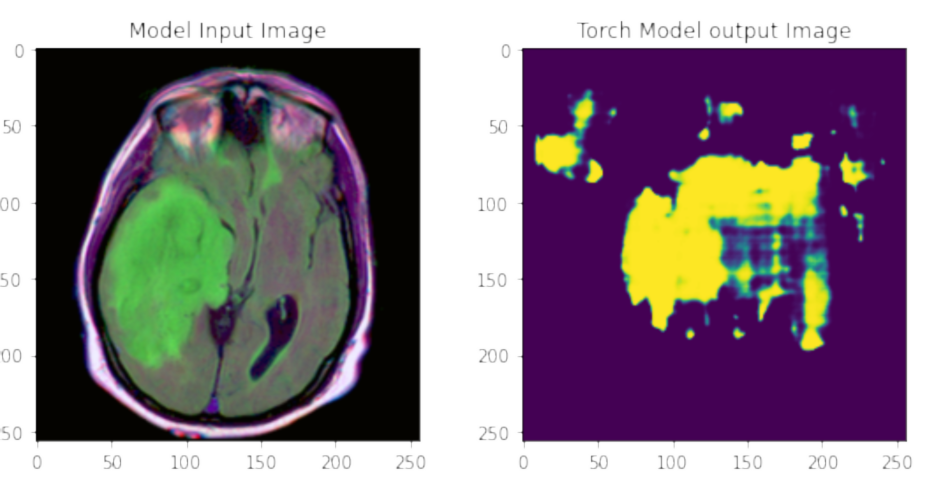

## U-Net: Convolutional Networks for Biomedical Image Segmentation

From the paper: [U-Net: Convolutional Networks for Biomedical Image Segmentation](https://arxiv.org/abs/1505.04597)

The model used has a encoder pre trained on Imagenet dataset but the model itself is not trained to produce any kind of specific segmentation and can be tuned to produce the desired results. 

The conversion of model with the weights from pytorch to onnx and then onnx to openvino is shown in the notebook. 

##  Model Input and output 

